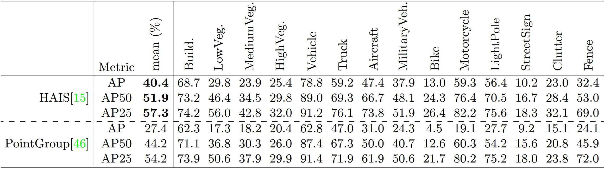

[](https://arxiv.org/abs/2203.09065)

# STPLS3D: A Large-Scale Synthetic and Real Aerial Photogrammetry 3D Point Cloud Dataset

[Meida Chen](https://scholar.google.com/citations?user=ii7ZwfQAAAAJ&hl=en), [Qingyong Hu](https://qingyonghu.github.io/), [Thomas Hugues](https://huguesthomas.github.io/), [Andrew Feng](https://scholar.google.com/citations?user=JKWxGfsAAAAJ&hl=en), [Yu Hou](https://www.yuhou.info/), [Kyle McCullough](https://ict.usc.edu/about-us/leadership/research-leadership/kyle-mccullough/), [Lucio Soibelman](https://viterbi.usc.edu/directory/faculty/Soibelman/Lucio). <br />
**[[Paper](https://arxiv.org/abs/2203.09065)] [[Project page](https://www.stpls3d.com/)] [[Video](https://youtu.be/6wYWVo6Cmfs)] [[Urban3D workshop@ECCV2022](https://urban3dchallenge.github.io/)] [[Instance segmentation competition](https://codalab.lisn.upsaclay.fr/competitions/4646)]** <br />


## (1) Our Focus

- Our project aims to provide a large database of annotated ground truth point clouds reconstructed using aerial photogrammetry.
- Our database can be used for training and validating 3D semantic and instance segmentation algorithms.
- We are developing a synthetic data generation pipeline to create synthetic training data that can augment or even replace real-world training data. 

## (2) Dataset

### 2.1 Overview

we have built a large-scale photogrammetry 3D point cloud dataset, termed Semantic Terrain Points Labeling - Synthetic 3D (STPLS3D), which is composed of high-quality, rich-annotated point clouds from real-world and synthetic environments. 

<p align="center">  </p>

### 2.2 Data Collection

We first collect real-world aerial images using photogrammetry best practices with quadcopter drone flight at a low altitude with significant overlaps between adjacent photos. We then reconstructed point clouds with 1.27 km^2 landscape following the standard photogrammetry pipeline. Next, we follow the same UAV path and flying pattern to generate 62 synthetic point clouds with different architectural styles, vegetation types, and terrain shapes. The synthetic dataset covers about 16 km^2 of the city landscape, with up to 18 fine-grained semantic classes and 14 instance classes. 

### 2.3 Synthetic data generation workflow demo

<p align="center"> <a href="https://youtu.be/6wYWVo6Cmfs"></a> </p>

### 2.4 Semantic Annotations

- 0-Ground: including grass, paved road, dirt, etc.
- 1-Building: including commercial, residential, educational buildings.
- 2-LowVegetation: 0.5 m < vegetation height < 2.0 m.
- 3-MediumVegetation: 2.0 m < vegetation height < 5.0 m.
- 4-HighVegetation: 5.0 m < vegetation height.
- 5-Vehicle: including sedans and hatchback cars.
- 6-Truck: including pickup trucks, cement trucks, flat-bed trailers, trailer trucks, etc.
- 7-Aircraft: including helicopters and airplanes.
- 8-MilitaryVehicle: including tanks and Humvees.
- 9-Bike: bicycles.
- 10-Motorcycle:  motorcycles.
- 11-LightPole: including light poles and traffic lights.
- 12-StreetSgin: including road signs erected at the side of roads.
- 13-Clutter: including city furniture, construction equipment, barricades, and other 3D shapes.
- 14-Fence: including timber, brick, concrete, metal fences.
- 15-Road: including asphalt and concrete roads.
- 17-Windows: glass windows.
- 18-Dirt: bare earth.
- 19-Grass: including grass lawn, wild grass, etc.

Note that not all datasets we are currently providing have all the semantic labels available, the ground points that don't have the material available (15, 18, 19) are labeled with 0.

### 2.5 Instance annotations

The ground is labeled with -100. Window instance is currently per building but not per window but could be post-processed using connect component algorithm. Our experiments did not include the window instances. 

Only synthetic datasets v2 and v3 have the instance labels.

## (3) Benchmarks

### 3.1 Semantic segmentation:

<p align="center">  </p>

### 3.2 Instance segmentation:

<p align="center">  </p>

## (4) Training and Evaluation
Here we provide the training and evaluation script for both semantic and instance segmentation.

### 4.1 Semantic segmentation:

***[KpConv](https://github.com/meidachen/STPLS3D/tree/main/KPConv-PyTorch) (Ubuntu and Windows 10):*** The [environment setup](https://github.com/HuguesTHOMAS/KPConv-PyTorch/blob/master/INSTALL.md) is the same as the official [KpConv](https://github.com/HuguesTHOMAS/KPConv-PyTorch) release. We follow the same steps as shown [here](https://github.com/HuguesTHOMAS/KPConv-PyTorch/blob/master/doc/scene_segmentation_guide.md) to evaluate KpConv on our STPLS3D dataset.

- Preparing the dataset

Download the [data](https://forms.gle/7e8enRwqGYkyM1398) and unzip it. Change the variable `self.path` of `STPLS3DDataset` class ([here](https://github.com/meidachen/STPLS3D/blob/40186210639c0e3f3d49c6b087986fbbb0babaa9/KPConv-PyTorch/datasets/STPLS3D.py#L82)) to the place where STPLS3D is stored.

```
STPLS3D
├── RealWorldData
│   ├── OCCC_points.ply
│   ├── ...
│   └── WMSC_points.ply
├── Synthetic_v1
│   ├── Austin.ply
│   ├── ...
│   └── TownshipofWashington.ply
├── Synthetic_v2
│   ├── 2_points_GTv2.ply
│   ├── ...
│   └── j_points_GTv2.ply
└── Synthetic_v3
    ├── 1_points_GTv3.ply
    ├── ...
    └── 25_points_GTv3.ply
```

- Start training:

```
python3 train_STPLS3D.py
```

- Evaluation:

```
python3 test_models.py
```


### 4.2 Instance segmentation:

***[HAIS](https://github.com/meidachen/STPLS3D/tree/main/HAIS) (Ubuntu):*** The environment setup is the same as the official [HAIS](https://github.com/hustvl/HAIS) release

- Setup the environment
```
git clone https://github.com/meidachen/STPLS3D.git
cd STPLS3D/HAIS
conda create -n hais python=3.7
conda activate hais
pip install -r requirements.txt
conda install -c bioconda google-sparsehash
conda install libboost
conda install -c daleydeng gcc-5
cd STPLS3D/HAIS/lib/spconv
export CUDACXX= $PATH_TO_NVCC$
python setup.py bdist_wheel
cd STPLS3D/HAIS/lib/spconv/dist
pip install {wheel_file_name}.whl
cd STPLS3D/HAIS/lib/hais_ops
export CPLUS_INCLUDE_PATH={conda_env_path}/hais/include:$CPLUS_INCLUDE_PATH
python setup.py build_ext develop
```

- Preparing the dataset

Download the [data](https://forms.gle/wGEp4HBSaUWtgnMi9), unzip it and place it under STPLS3D/HAIS/dataset.
```
HAIS
├── dataset
   └── Synthetic_v3_InstanceSegmentation
       ├── 1_points_GTv3.txt
       ├── 2_points_GTv3.txt
       ├── 3_points_GTv3.txt
       ├── ...
       ├── 23_points_GTv3.txt
       ├── 24_points_GTv3.txt
       └── 25_points_GTv3.txt
```

```
cd STPLS3D/HAIS/data
python prepare_data_inst_instance_stpls3d.py
```

(optional) In case you are changing training data (i.e., not using data agumentation, using different ways for data agumentation, etc.), please run prepare_data_statistic_stpls3d.py to get the class_weight, class_radius_mean, and class_numpoint_mean_dict. Change them in hais_run_stpls3d.yaml, hierarchical_aggregation.cpp, and hierarchical_aggregation.cu accordingly. Make sure you rebuild the hais_ops.

- Start training:
```
CUDA_VISIBLE_DEVICES=1 python train.py --config config/hais_run_stpls3d.yaml 
```

- Evaluation:
```
CUDA_VISIBLE_DEVICES=1 python test.py --config config/hais_run_stpls3d.yaml --pretrain exp/Synthetic_v3_InstanceSegmentation/hais/hais_run_stpls3d/hais_run_stpls3d-000000500.pth
```

## (5) Instance segmentation challenge and evaluation server

We are also organizing a instance segmentation challenge on CodaLab! Please feel free to submit your results to our [evaluation server](https://codalab.lisn.upsaclay.fr/competitions/4646) with the [unlabled testing datasets](https://webdisk.ict.usc.edu/index.php/s/oqO0sgiZfoa6Ofr).  

## Citation
If you find our work useful in your research, please consider citing:

	@article{chen2022stpls3d,
	  title={STPLS3D: A Large-Scale Synthetic and Real Aerial Photogrammetry 3D Point Cloud Dataset},
	  author={Chen, Meida and Hu, Qingyong and Hugues, Thomas and Feng, Andrew and Hou, Yu and McCullough, Kyle and Soibelman, Lucio},
	  journal={arXiv preprint arXiv:2203.09065},
	  year={2022}
	}

## Updates
* 03/25/2022: we are organizing the [Urban3D@ECCV2022 - The 2nd Challenge on Large-Scale Point Clouds Analysis for Urban Scenes Understanding](https://urban3dchallenge.github.io/)!
* 11/01/2021: Initial release!
