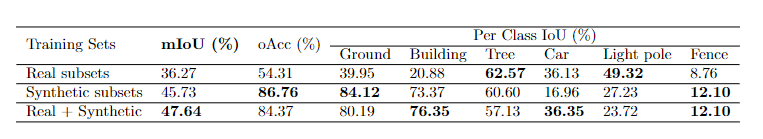

# Point Transformer for STPLS3D
This repository applies [Point Transformer](https://arxiv.org/abs/2012.09164) implemented by [POSTECH-CVLab](https://github.com/POSTECH-CVLab/point-transformer) to our STPLS3D for point cloud semantic segmentation. 

---
## Update 06/15/2022

- Upload the merge_block_vis.py to merge blocks and save the whole point clouds with predicted labels in .ply format. The field names of the ply file are \['x', 'y', 'z', 'red', 'green', 'blue', 'pred_label'\] 

## Dependencies
- Ubuntu: 18.04 or higher
- PyTorch: 1.9.0 
- CUDA: 11.1 
- Hardware: 4GPUs (Nvidia RTX 2080Ti) or 2GPUs (Nvidia RTX 3090) to reproduce
- To create conda environment, command as follows:

  ```
  bash env_setup.sh pt
  ```

## Dataset preparation
- Download STPLS3D [dataset](https://docs.google.com/forms/d/e/1FAIpQLSeysqIANfUmBuOYipjMPXFk4t8a850mz6L9GISYTKqGnMQ74w/viewform) and generate sub blocks from the large scale point clouds:

     ```
     python ./tool/generate_blocks.py -d /path/to/dataset/
     ```

## Usage
- Semantic point cloud segmantation and evaluation on WMSC.
  - Train

    - Specify the gpu used and the path of dataset in config and then do training:

      ```
      sh tool/train.sh stpls pointtransformer_repro
      ```

  - Test

    - Afer training, you can test the checkpoint as follows:

      ```
      CUDA_VISIBLE_DEVICES=0 sh tool/test.sh stpls pointtransformer_repro
      ```
  - Post-processing

    - Merge original input point cloud blocks with predictions for visualization.  

      ```
      python ./tool/merge_block_vis.py -d /path/to/inputs -p /path/to/predictions -s /path/to/save/ply
      ```
  ---
## Experimental Results

- Point Cloud Semanctic Segmentation Quantitative Results on WMSC
  
  <p align="center">  </p>

---

## Acknowledgement
The code is from the [POSTECH-CVLab](https://github.com/POSTECH-CVLab/point-transformer).
